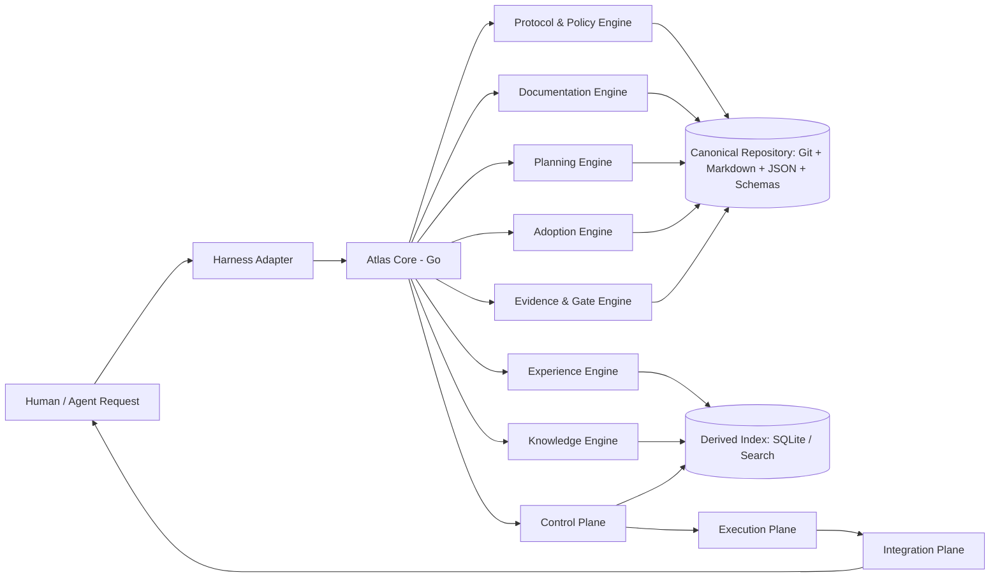
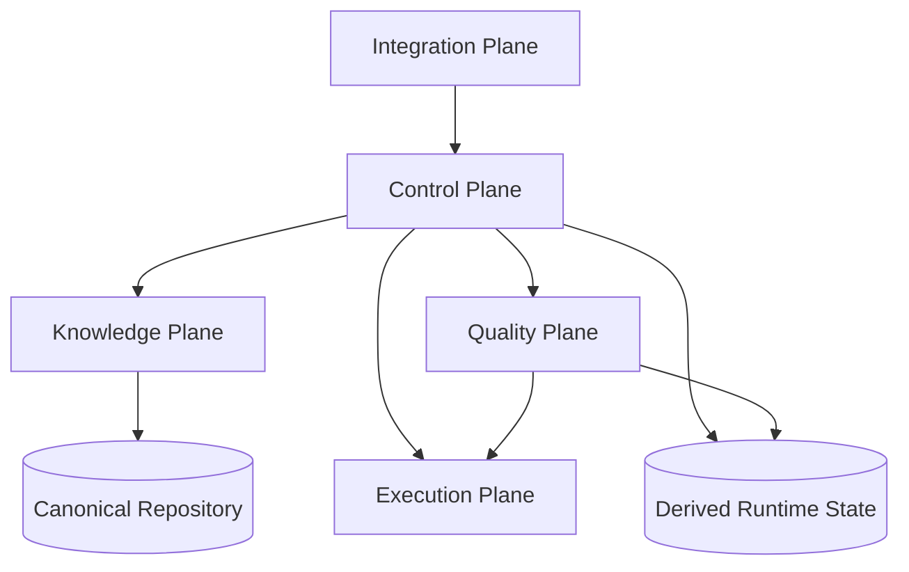

# Atlas v0.4 Architecture Overview

## High-Level Topology



## Planes & Boundaries

### Control Plane (Horizontal Infrastructure)
| Service | Responsibility |
|---------|----------------|
| `RunService` | Run lifecycle, checkpoints, retry, resume, cancellation, livelock detection |
| `BudgetService` | Hierarchical budget envelopes, cost governance, rate limits |
| `ContextService` | Context Compiler pipeline, token budgets, cache awareness, compaction |
| `ModelRoutingService` | Model Registry, eval-driven router, drift detection, fallback |
| `ToolGateway` | Tool descriptors, lazy discovery, side-effect journal, MCP governance |
| `EnvironmentService` | Sandbox contract, isolation requirements, execution environments |
| `AutomationService` | Event-driven rules, DLQ, idempotency, concurrency keys |
| `ObservabilityService` | Structured telemetry, explainability, incident bundles |
| `PackageRuntimeService` | `atlas.lock`, provider isolation, supply chain verification |

### Knowledge Plane (Canonical State)
| Engine | Responsibility |
|--------|----------------|
| Goals | Lifecycle, locks, amendments, state transitions |
| Documentation | Contracts, profiles, readiness, delta, contradictions |
| Planning | Interview, decisions, open questions, confidence |
| Adoption | Scanner, semantic mapping, gap detection, migration |
| Experience | Session events, summaries, handoffs, proposals |
| Traceability | Typed edges: req↔dec↔code↔test↔doc↔evidence |

### Quality Plane (Verification)
| Component | Responsibility |
|-----------|----------------|
| Test Providers | Contract-based: Playwright, ZAP, CodeQL, fuzzers, sanitizers, UIA/AX/AT-SPI, KUnit, syzkaller |
| Quality Orchestrator | Deterministic plan from change impact + risk + capabilities |
| Evidence Normalization | Common schema for runs, findings, artifacts, environment fingerprint |
| Security Verifier | Independent verification for high/critical risk |

### Execution Plane (External Providers)
Models, tools/MCPs, sandboxes/runtimes, external providers. **Never import canonical rules.**

### Integration Plane (Adapters)
OpenCode, Codex, Claude Code, Gemini CLI, Copilot CLI, Kiro, Generic. **Thin adapters only — no canonical logic.**

## Dependency Direction



**Rules:**
- Domain/Protocol never imports CLI, concrete storage, or harness
- CLI depends on Application Services
- Storage implements ports defined by consumers
- Integrations call Atlas Core via stable CLI JSON/stdio or versioned API
- SQLite never required to interpret canonical state
- External harness never controls invariants

## Interface Boundaries

Interfaces exist **only** at real boundaries with multiple implementations:
- `Repository` (Git filesystem)
- `EventSink` (local file, OTLP, in-memory)
- `DerivedIndex` (SQLite, in-memory, future)
- `HarnessTransport` (stdio, HTTP, MCP)
- `Clock` (tests)
- `EmbeddingProvider` (future)

**Avoid premature interfaces** during Go migration.

## Internal Machine API

Versioned, stable commands for plugins/adapters:
```
atlas internal project-status --json
atlas internal resolve --json
atlas internal validate-tool --json
atlas internal docs-impact --json
atlas internal context --json
atlas internal handoff --json
```

## Protocol Version Negotiation

Every adapter declares:
- connector id/version
- Atlas protocol version supported
- capabilities
- lifecycle hooks
- write-blocking support
- agent/skill primitives

Atlas refuses "strict" enforcement when harness lacks sufficient primitives.

## Design Principle

> **Hard-code invariants; configure policies; evaluate heuristics.**
>
> - Invariants: Goal lock, schema validation, evidence requirements
> - Policies: independent verifier for critical risk, budget limits
> - Heuristics: workforce size, model routing, context packing (subject to evals)