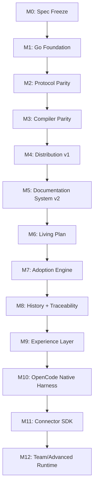

# Project Atlas v0.4 Implementation Blueprint

## Objective

Migrate Project Atlas from Python v0.3 to Go v0.4 with full protocol parity, then incrementally deliver the Control Plane, Documentation System, Living Plan, Adoption Engine, Knowledge/Experience layers, and native harness integrations — all validated by deterministic conformance and eval suites.

## Non-Goals

- Rewrite all ~98 existing skills mechanically before Skill Package v3 + evals
- Add dozens of test providers before Provider Contract + Evidence Schema stabilize
- Build Game Development Suite before foundational contracts
- Create distributed scheduler or central team server
- Fork any harness (OpenCode, Codex, etc.)
- Public Go SDK before CLI/machine protocol stabilizes

## Architecture Summary

| Plane | Key Components |
|-------|----------------|
| **Protocol** | Goals, Plans, Tasks, Events, Evidence, Gates, Schema Validation |
| **Project** | Root discovery, `atlas.json`, profiles, capabilities |
| **Resolution** | Risk, workforce, recipes, model policy, context selection |
| **Documentation** | Contracts, profiles, coverage, delta, contradictions |
| **Planning** | Interview, decisions, open questions, authority, readiness |
| **Adoption** | Scanner, semantic mapping, confidence ledger, migration |
| **Knowledge** | Typed traceability graph, retrieval, contradictions |
| **Experience** | Session events, summaries, handoffs, proposals |
| **Evidence/Gates** | Deterministic validation, risk-based evidence, release gates |
| **Control Plane** | Run, Budget, Context, Model Router, Tool Gateway, Env, Automation, Observability |
| **Integration** | Connector Contract, OpenCode native, Generic fallback |

## Migration Python → Go

### Strategy: Conformance-Driven Migration

1. **Freeze v0.3 behavior** — catalog all observable contracts (exit codes, JSON schemas, golden outputs)
2. **Build Go foundation** — module, CLI skeleton, protocol envelope, project discovery, schema validation
3. **Port protocol domain** — Goals, Plans, Tasks, Events, Evidence, Gates, locks, amendments
4. **Port resolution** — workforce resolver, model policy, risk assessment, context selection
5. **Port CLI surface** — all 12 v0.3 commands with identical behavior
6. **Port compilers** — Codex, Claude Code, Generic (+ ancillary)
7. **100% Conformance** — Python oracle vs Go on identical fixtures
8. **Deprecate Python** — only after verified parity

### Migration Rules

- **Zero v0.4 features in Python** — only critical bug fixes
- **Python is oracle** — Go must match behavior, not just pass unit tests
- **Golden fixtures are canon** — `conformance/golden/` captured from Python v0.3
- **Schemas unchanged** — Go conforms to Atlas protocol; protocol never changes for Go convenience

## Macro-Phases

## Phase Dependency DAG

| Phase | Depends On | Blocks |
|-------|------------|--------|
| M0 | — | M1 |
| M1 | M0 | M2, M3 |
| M2 | M1 | M3, M5, M6, M7, M8, M9 |
| M3 | M2 | M4, M10 |
| M4 | M3 | M5, M10 |
| M5 | M2, M4 | M6, M7, M9 |
| M6 | M5 | M7, M9 |
| M7 | M5, M6 | M8, M9 |
| M8 | M2, M6 | M9 |
| M9 | M5, M6, M7, M8 | M10 |
| M10 | M3, M4, M9 | M11 |
| M11 | M10 | M12 |
| M12 | M11 | — |

## Inter-Phase Gates

| Gate | Criteria |
|------|----------|
| **M0→M1** | Architecture Freeze recorded; v0.3 inventory complete; Go module initialized; conformance matrix defined |
| **M1→M2** | Go module builds; CLI skeleton works; project discovery + schema validation + embedded resources + error model + test infra all green |
| **M2→M3** | Goals/Plans/Tasks/Events/Evidence/Gates all ported; resolver/workforce/model policy ported; doctor/explain parity; conformance ≥ 90% on protocol |
| **M3→M4** | Compiler parity for Codex, Claude Code, Generic; conformance 100% on critical contracts |
| **M4→M5** | Binaries published; install/uninstall/setup work; Homebrew/Windows baseline; `atlas setup` wizard |
| **M5→M6** | Documentation Contracts + Profiles + UI Pack + Delta + Contradiction framework all functional |
| **M6→M7** | Interview protocol + decision extraction + authority model + incremental docs updates working |
| **M7→M8** | Scanner + semantic mapping + capabilities + confidence ledger + adoption report + migration proposals |
| **M8→M9** | Implementation journal + experiment/rejection/debt registers + typed graph + trace CLI |
| **M9→M10** | Session events + summaries + handoffs + provider contract + experience proposals + retention |
| **M10→M11** | OpenCode native compiler + Atlas primary agent + subagents/skills/commands + TS plugin + tool guards + session hooks + connector contract tests |
| **M11→M12** | Capability negotiation + cleanup manifests + test kit + Gemini CLI connector + Claude/Codex elevation |
| **M12→v1.0** | Team runtime validated by real usage; production hardening complete |

## Self-Dogfooding Threshold

- **M3+**: Atlas builds/tests itself (Go tests, `atlas doctor`, `atlas validate`)
- **M5+**: Atlas documents its own development (contracts, profiles, readiness on Atlas repo)
- **M6+**: Atlas plans its own features via Living Plan
- **M7+**: Atlas adopts its own repo history (Adoption Engine on Atlas)
- **M8+**: Atlas traces its own decisions (traceability on Atlas)
- **M9+**: Atlas learns from its own sessions (Experience Layer on Atlas)
- **M10+**: Atlas develops via OpenCode native harness

## Release Progression

| Stage | Criteria |
|-------|----------|
| `0.4.0-alpha` | M3 complete: protocol parity, Go self-hosting, core conformance |
| `0.4.0-beta` | M5 complete: docs system, distribution, installer |
| `0.4.0-rc` | M10 complete: OpenCode native, connector SDK, major planes |
| `0.4.0` | M11 complete: all core v0.4 capabilities verified |
| `1.0.0` | M12+ real usage validated; production hardening; stability window |

## Mandatory Documentation Per Phase

| Phase | Required Docs |
|-------|---------------|
| All | Updated `CHANGELOG.md`, `AGENTS.md` if process changes |
| M0 | `docs/migration/protocol-inventory.md`, `docs/migration/conformance-strategy.md` |
| M1 | `docs/development/repository-layout.md`, `docs/development/coding-standards.md` |
| M2 | `docs/architecture/overview.md`, `docs/architecture/dependency-rules.md` |
| M3 | `docs/reference/cli.md`, `docs/reference/schemas.md` |
| M4 | `docs/getting-started/installation.md`, `docs/reference/connector-contract.md` |
| M5 | `docs/reference/documentation-contracts.md`, `docs/reference/documentation-profiles.md` |
| M6 | `docs/reference/living-plan.md`, `docs/reference/interview-engine.md` |
| M7 | `docs/reference/adoption-engine.md` |
| M8 | `docs/reference/traceability.md`, `docs/reference/experience.md` |
| M9 | `docs/reference/handoff-protocol.md` |
| M10 | `docs/integrations/opencode.md`, `docs/integrations/connector-contract.md` |

## OPEN QUESTIONS

- [ ] Exact scope of "critical contracts" for M2→M3 gate
- [ ] Whether M4 (Distribution) can parallelize with M5 (Docs System)
- [ ] Skill Package v3 reference skills selection for M5.5
- [ ] Test Provider Contract first providers for M5.5 (Playwright + ZAP minimum?)
- [ ] Security Engineering Foundation scope for M7.5