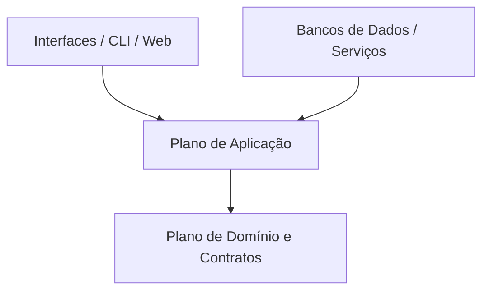

# Visão Geral de Arquitetura

## Topologia do Sistema

O projeto é estruturado em três planos concêntricos:

1. **Plano de Domínio**: Entidades essenciais, regras de negócio e validações puras.
2. **Plano de Aplicação**: Casos de uso, orquestração de operações e fluxos de tarefas.
3. **Plano de Adaptadores e Infraestrutura**: Drivers de persistência, conectores externos, interfaces de CLI e mensageria.

## Diagrama Conceitual

