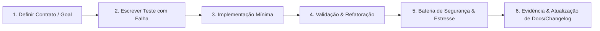

# Estratégia de Testes Exaustivos e Ciclo de Qualidade

Este documento codifica o **ciclo mandatório e rigoroso de testes e qualidade** aplicado a todas as implementações deste projeto. Nenhum código é integrado sem evidências automatizadas de aprovação em todos os níveis da pirâmide.

---

## 1. O Loop Rigoroso de Implementação (TDD / BDD)

Para cada nova funcionalidade ou correção de defeito:

1. **Definição de Contratos**: Especificar a interface, tipos e critérios de aceitação.
2. **Teste Inicial**: Criar teste que reproduza a falha ou verifique o comportamento esperado antes de codificar a solução.
3. **Implementação**: Escrever código limpo, modular e desacoplado que satisfaça o teste.
4. **Refatoração**: Aplicar princípios de Clean Code sem quebrar nenhum teste existente.
5. **Varredura Completa**: Executar suíte de conformidade, segurança, performance e estresse.
6. **Evidência e Changelog**: Atualizar documentação afetada e registrar a mudança no `CHANGELOG.md`.

---

## 2. As Camadas da Pirâmide de Testes

### A. Funcionalidade
- **Testes Unitários**: Determinísticos, rápidos (milissegundos), sem chamadas de rede ou I/O real. Cobertura mínima exigida: **85%**.
- **Testes de Integração**: Testam interações reais entre módulos, adaptadores de banco de dados e sistemas de arquivos com fixtures isoladas.
- **Testes de Contrato**: Validação de comunicação entre serviços e interfaces públicas.

### B. Conformidade e Validação Estática
- **Linters**: Verificação estrita de sintaxe, tipos e convenções.
- **Schemas**: Validação de todas as estruturas de entrada/saída contra esquemas JSON Draft 2020-12.
- **Formatação**: Zero divergência em relação ao padrão canônico.

### C. Segurança (DevSecOps)
- **Varredura de Segredos**: Proibição de chaves, senhas ou tokens no código (verificação automatizada pré-commit).
- **SAST (Static Application Security Testing)**: Análise estática contra injeção de comandos, XSS, SSRF e vulnerabilidades OWASP Top 10.
- **Auditoria de Dependências**: Detecção de CVEs e bibliotecas vulneráveis ou obsoletas na cadeia de suprimentos.
- **Princípio do Menor Privilégio**: Testes de permissões restritas em tempo de execução.

### D. Performance, Carga e Estresse
- **Benchmarks**: Medição contínua de latência e consumo de memória por operação.
- **Testes de Concorrência & Deadlock**: Detecção de condições de corrida (`-race`), bloqueios mútuos e vazamentos de recursos/goroutines.
- **Testes de Estresse & Carga**: Submissão a picos de tráfego e limites extremos para verificar comportamento de degradação graciosa.

### E. Frontend, UI e Experiência do Usuário
- **Testes de Componentes**: Renderização isolada e testes de interação com frameworks de teste modernos.
- **Testes End-to-End (E2E)**: Simulação de jornadas reais de usuário via navegadores headless (Playwright / Cypress).
- **Regressão Visual**: Comparação de screenshots para evitar desvios visuais de layout.
- **Acessibilidade**: Varredura automatizada contra as diretrizes WCAG 2.1 AA (axe-core).

---

## 3. Comandos de Execução Recomendados

| Categoria | Exemplo de Ferramenta | Comando Padrão |
|-----------|------------------------|----------------|
| Unitário & Corrida | Go test / Vitest / Pytest | `go test -v -race ./...` |
| Formatação | Official formatter | `gofmt -d .` ou `prettier --check .` |
| Linter | Staticcheck / ESLint / Ruff | `staticcheck ./...` |
| Segurança | Secret scanner / Trivy | `atlas tool scan-secrets .` |
| UI & E2E | Playwright | `npx playwright test` |
| Carga | k6 / Vegeta | `k6 run load-test.js` |
